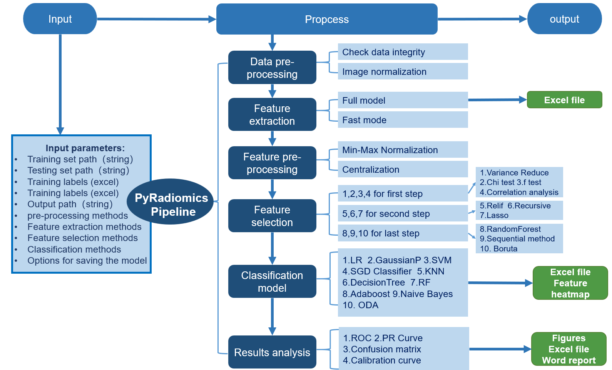

# PyRadiomics Pipeline

A fully automated pipeline for radiomics feature extraction, selection, classification, and analysis.  
This framework supports batch processing of medical images and structured patient information, designed for reproducible radiomics research.

## 🧠 Features
- Preprocessing of image and patient-level data  
- Support for full feature extraction with customizable filters and modalities  
- Multiple feature selection strategies including statistical tests, mutual information, and machine learning models  
- 10 built-in classification algorithms, including Logistic Regression, SVM, and Random Forest  
- Rich output formats: Excel files, plots, and Word reports  
- Easily configurable via command-line arguments  

## 🚀 Installation

To install the pipeline, follow these steps:

```bash
git clone https://github.com/SqL-2024/pyradiomics-pipeline.git
cd pyradiomics-pipeline
pip install -r requirements.txt

```

## 📁 Input Files
| File Type            | Description                                      |
|----------------------|--------------------------------------------------|
| `.nii` or `.mha`     | Medical image and mask files(e.g., MRI, CT)                           |
| `.xlsx`              | Excel file containing clinical information for training/testing cohorts |
| `.json/.txt`         | Configuration parameters (optional)              |

## 🛠 How to Use

You can run the full pipeline by configuring the input arguments in run_main.py and run:
```
python run_main.py
```
### 📌 Parameters

- `-t`, `--data_dir`:  
  Path to the training dataset (medical images).

- `-i`, `--patient_info`:  
  Path to the Excel file containing patient case and label information.

- `-s`, `--save_dir`:  
  Path to save the extracted features and classification results.

- `-v`, `--test_size`:  
  Proportion of the dataset to use for validation (default: `0.3`).

- `-m`, `--modality`:  
  Modalities of the images (e.g., `"T1,T2"` for MRI sequences).

- `-rt`, `--radiomic_feature_types`:  
  Types of features to extract (e.g., `"first_order,shape3d"`).  
  For more details: [PyRadiomics Feature Classes](https://pyradiomics.readthedocs.io/en/latest/features.html)

- `-f`, `--image_filters`:  
  Filters applied to the input image before feature extraction (e.g., `"original,log_1,log_3"`).  
  For more details: [PyRadiomics Image Filters](https://pyradiomics.readthedocs.io/en/latest/radiomics.html#module-radiomics.imageoperations)

- `-p`, `--feature_preprocessing_method`:  
  Method for feature preprocessing:  
  `0` - Standardization `((x - mean) / std)`  
  `1` - Normalization `(rescale to 0-1)`

- `-fs`, `--feature_selection_methods`:  
  Feature selection strategies (e.g., `"1,p_feature,0.5/4,p_feature,0.5/8"`).  
  Supports methods such as:
  - `1` - Chi-square test
  - `2` - F-value filtering
  - `3` - Mutual information
  - `4` - mRMR
  - `5` - Relief
  - `6` - RFE with SVM
  - `7` - Lasso
  - `8` - RandomForest importance
  - `9` - Sequential Feature Selection (e.g., `{"num_features": 20, "classifier": "random_forest", "direction": "forward"}`)
  - `10` - Boruta

- `-c`, `--classifier`:  
  Classification algorithms to use (comma-separated indices). Options include:
  - `0` - Logistic Regression  
  - `1` - Gaussian Process Classifier  
  - `2` - Support Vector Machine  
  - `3` - SGD Classifier  
  - `4` - K-Nearest Neighbors  
  - `5` - Decision Tree  
  - `6` - Random Forest  
  - `7` - AdaBoost  
  - `8` - Naive Bayes  
  - `9` - Quadratic Discriminant Analysis  

- `-r`, `--random_seed`:  
  Random seed for reproducibility.

---

For more detailed explanations of each parameter and additional options, refer to the [official documentation](https://pyradiomics.readthedocs.io/) or internal user manual.

## 🔄 Workflow Overview



### 🧩 Modules

| Step                   | Description |
|------------------------|-------------|
| **Data Preprocessing** | Inspection and normalization of image data |
| **Feature Extraction** | PyRadiomics-based extraction in full or fast mode |
| **Feature Preprocessing** | Min-max scaling or Z-score standardization |
| **Feature Selection**  | 10 configurable methods including Relief, Lasso, Boruta |
| **Classification**     | 10 classifiers: SVM, RF, KNN, LR, etc. |
| **Result Analysis**    | ROC, PR, calibration curve, confusion matrix |
| **Output**             | Excel summaries, plots, and Word reports |

## 📦 Output Structure

```plaintext
/results/
├── extracted_features.xlsx
├── selected_features_heatmap.xlsx
├── classification_results/
│   ├── ROC_curve.png
│   ├── PR_curve.png
│   ├── Confusion_matrix.png
│   ├── Calibration_curve.png
├── report.docx
```

## 📚 Citation
If you use this pipeline in your research, please cite any of the following works that were developed using this tool.:

1. Du J, He X, Fan R, Zhang Y, Liu H, Liu H, **Liu S**, Li S.  
   *Artificial intelligence-assisted precise preoperative prediction of lateral cervical lymph nodes metastasis in papillary thyroid carcinoma via a clinical-CT radiomic combined model.*  
   **International Journal of Surgery.** 2025;111(3):2453–2466.  
   [doi:10.1097/JS9.0000000000002267](https://doi.org/10.1097/JS9.0000000000002267) | PMID: [39903541](https://pubmed.ncbi.nlm.nih.gov/39903541/)

2. **Liu S**, Liang W, Huang P, Chen D, He Q, Ning Z, Zhang Y, Xiong W, Yu J, Chen T.  
   *Multi-modal analysis for accurate prediction of preoperative stage and indications of optimal treatment in gastric cancer.*  
   **Radiologia Medica.** 2023;128(5):509–519.  
   [doi:10.1007/s11547-023-01625-6](https://doi.org/10.1007/s11547-023-01625-6) | PMID: [37115392](https://pubmed.ncbi.nlm.nih.gov/37115392/)

3. Wang X, **Liu S**, Yan Z, Yin F, Feng J, Liu H, Liu Y, Li Y.  
   *Radiomics nomograms based on multi-sequence MRI for identifying cognitive impairment and predicting cognitive progression in relapsing-remitting multiple sclerosis.*  
   **Academic Radiology.** 2025;32(1):411–424.  
   [doi:10.1016/j.acra.2024.08.026](https://doi.org/10.1016/j.acra.2024.08.026) | PMID: [39198138](https://pubmed.ncbi.nlm.nih.gov/39198138/)
